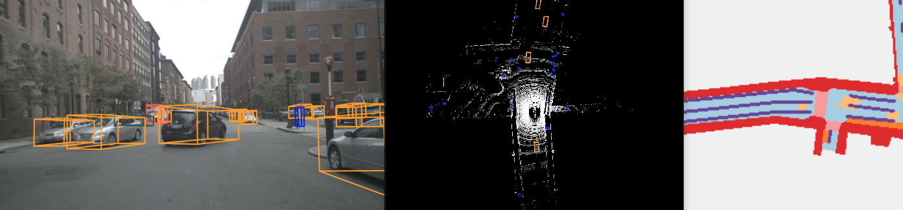

#  环境配置与运行

# 1 env
+ pythno-3.8、torch-1.10.0、cuda-11.3
1. 依赖
~~~python
pip install numpy==1.19.5 Pillow==8.4.0 tqdm torchpack mmcv==1.4.0 mmcv-full==1.4.0 mmdet==2.20.0 nuscenes-devkit mpi4py==3.0.3 numba==0.48.0 setuptools==56.1.0 
~~~

2. openmpi
~~~python
conda install openmpi==4.1.5
~~~

3. 根据`setup.py`进行配置, 这里会安装`mmdet3d`包
~~~python
pip install -v -e .

# -v 调试信息
# -e 可编辑模型
# . 寻找当前目录下的setup.py
~~~

+ 运行完，显示如下：
~~~python
Successfully installed mmdet3d-0.0.0
~~~

4. 查看相关版本号
+ 查看`torch,cuda`相关包版本号
~~~python
python -c 'import torch;print(torch.__version__);print(torch.version.cuda);print(torch.cuda.is_available())'
~~~

+ 查看mmopenlab相关包版本号
~~~python
python -c 'import mmcv;import mmdet;import mmdet3d;print(mmcv.__version__);print(mmdet.__version__);print(mmdet3d.__version__)'
~~~

---

# 2 报错整理

1. 将`mmdet3d/ops/spconv/src/indice_cuda.cu`文件里面所有的4096改为256

2. 算力更改：setup.py文件中第22行左右，只保留一行`-gencode=arch=compute_86,code=sm_86"`

+ 参数86就是自己显卡的算力根据实际修改, [显卡算力查询](https://developer.nvidia.com/cuda-gpus)

3. 运行`tools/visualize.py`报错

+ 错误1 `No module named 'torchpack.utils.tqdm'`
把`tools/visualize.py`文件中`from torchpack.utils.tqdm import tqdm`改成`from tqdm import tqdm`,如下：

~~~python
# from torchpack.utils.tqdm import tqdm
from tqdm import tqdm
~~~

+ 错误2 
`mmdet3d/models/vtransforms/base.py`中forward函数倒数第一行加上`metas`变量
~~~python
def forward(
        ...
        metas,
        **kwargs,
    ):
~~~

---

# 3 运行

1. 准备数据集

+ `nuscenes-mini`数据集得加上`--version v1.0-mini`参数，下以`nuscenes-mini`作测试

~~~python
# nuscenes-mini
python tools/create_data.py nuscenes --root-path ./data/nuscenes --out-dir ./data/nuscenes --extra-tag nuscenes --version v1.0-mini

# nuscenes
python tools/create_data.py nuscenes --root-path ./data/nuscenes --out-dir ./data/nuscenes --extra-tag nuscenes
~~~

2. 预训练权重
~~~
./tools/download_pretrained.sh
~~~

3. 训练
+ 只有一张显卡： `-np 1`
+ `configs/default.yaml`中修改epoch：`max_epochs: 2`

~~~python
torchpack dist-run -np 1 python tools/train.py configs/nuscenes/det/centerhead/lssfpn/camera/256x704/swint/default.yaml --model.encoders.camera.backbone.init_cfg.checkpoint pretrained/swint-nuimages-pretrained.pth --run-dir train_result
~~~

训练完成后会在`train_result目录下生成下面文件` 结构如下：
~~~python
└── train_result
    ├── 20230809_203249.log
    ├── 20230809_203249.log.json
    ├── configs.yaml
    ├── epoch_2.pth
    ├── latest.pth -> epoch_2.pth
    ├── logging
    └── tf_logs
~~~

+ `configs.yaml`和`latest.pth`在test和可视化需要使用

5. 测试
~~~python
# pretrained
torchpack dist-run -np 1 python tools/test.py configs/nuscenes/det/centerhead/lssfpn/camera/256x704/swint/default.yaml pretrained/swint-nuimages-pretrained.pth --eval bbox --out box.pkl

# Custom
torchpack dist-run -np 1 python tools/test.py train_result/configs.yaml train_result/latest.pth --eval bbox --out box.pkl
~~~

运行后会生成box.pkl文档

6. visualize

+ 首先改错误`1.2`小节`3.`的2个错误
~~~python
# Custom
torchpack dist-run -np 1 python tools/visualize.py train_result/configs.yaml --mode pred --checkpoint train_result/latest.pth --bbox-score 0.2 --out-dir vis_result

# gt
torchpack dist-run -np 1 python tools/visualize.py train_result/configs.yaml --mode gt --checkpoint train_result/latest.pth --bbox-score 0.5 --out-dir vis_result 

# pretrained
torchpack dist-run -np 1 python tools/visualize.py train_result/configs.yaml --mode pred --checkpoint pretrained/swint-nuimages-pretrained.pth --bbox-score 0.2 --out-dir vis_result
~~~

+ 运行后会在`vis_result`下生成可视化结果，如下：
~~~python
└── vis_result
    ├── camera-0
    ├── camera-1
    ├── camera-2
    ├── camera-3
    ├── camera-4
    ├── camera-5
    └── lidar
~~~

运行`--mode gt`模式，也就是标签数据可视化，自己训练权重效果比较差(原因：钞能力有限)，可视化结果如下：

